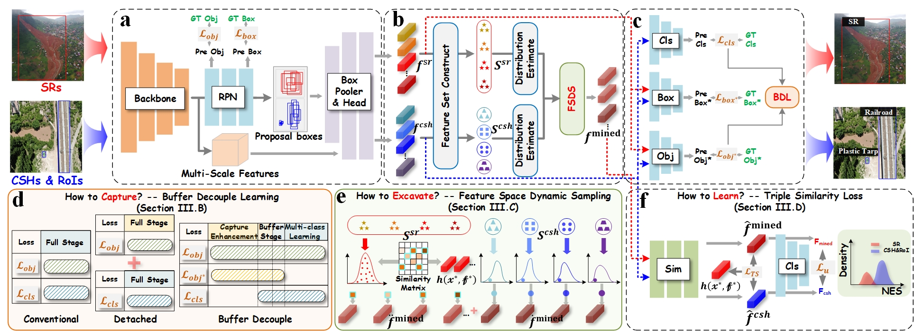

**SRLF: Sparse Representation Learning Framework for Railroad Surrounding Potential Risk Perception Using UAV Imagery**

------

This is the official PyTorch implementation of **SRLF**, we will be posting the code here soon, stay tuned!!!!

