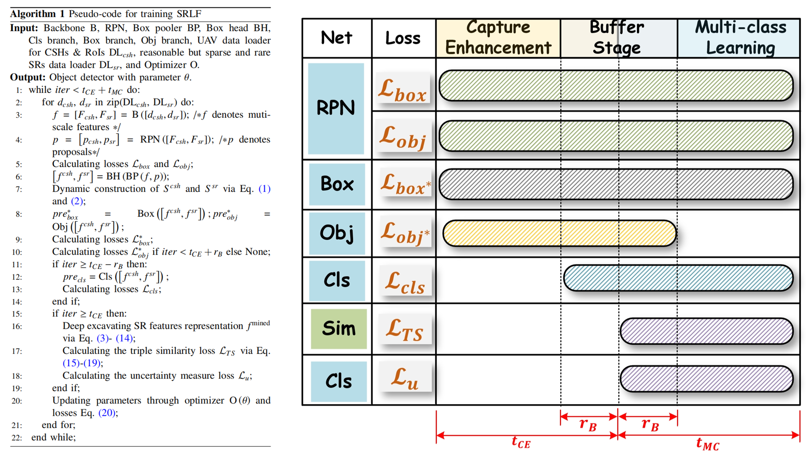
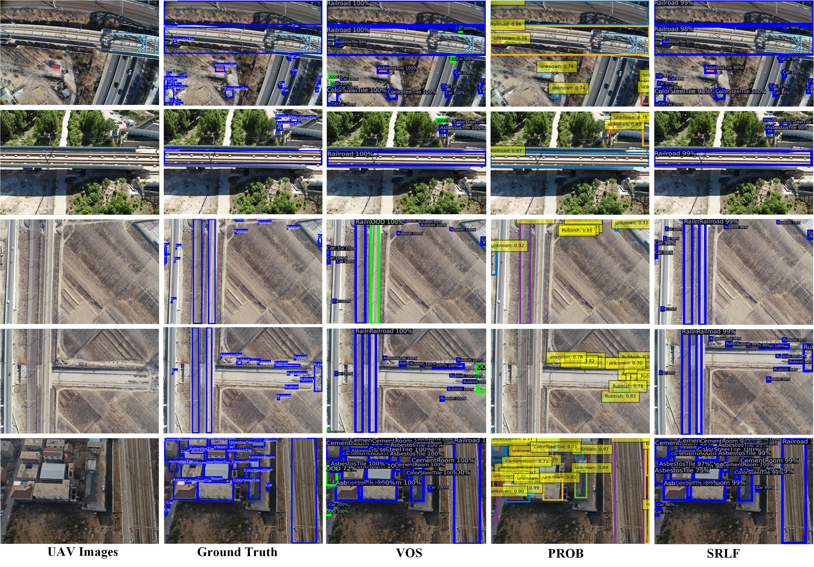
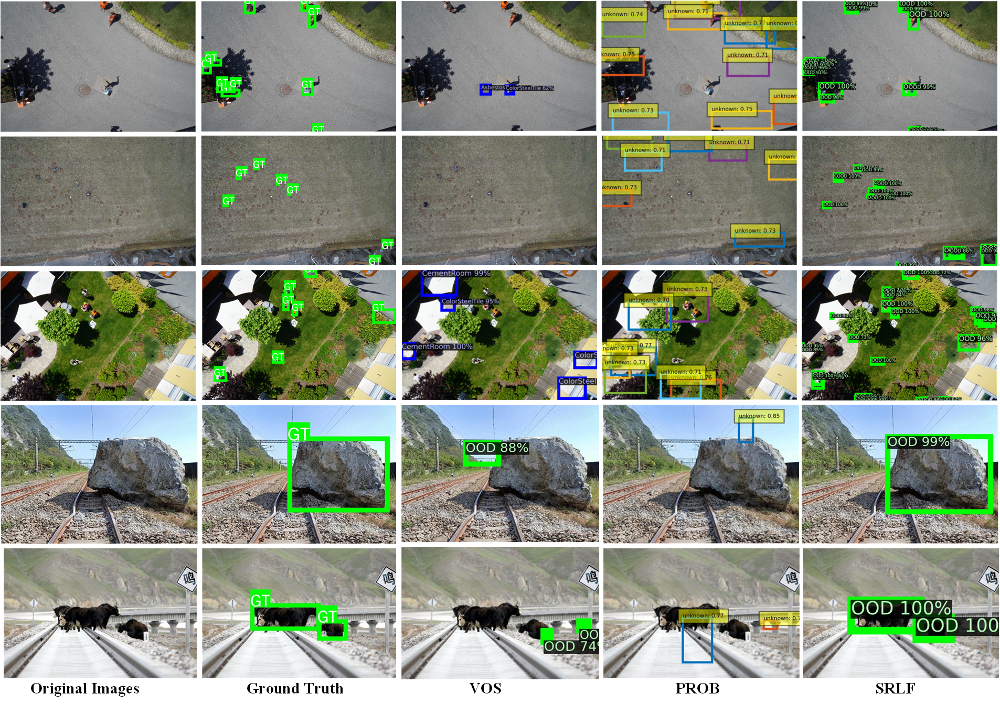

<h1 align="center">⚡ SRLF: Sparse Representation Learning Framework ⚡</h1>

<p align="center">
  
  
  
  
</p>

<p align="center">
  
</p>

---

## 🌟 Overview

This repository provides the **official implementation** of our IEEE T-ITS 2025 paper:  

> **“SRLF: Sparse Representation Learning Framework for Railroad Surrounding Potential Risk Perception Using UAV Imagery”**  
> *Fanteng Meng, Yong Qin, Yunpeng Wu, Mingyang Chen, Ninghai Qiu, Zhipeng Wang, Chongchong Yu, Huaizhi Yang*  
> 📄 [Read on IEEE Xplore](https://ieeexplore.ieee.org/document/11218800)

---

### 🧩 Abstract
Railroad safety depends on continuous monitoring of surrounding risks.  
We propose **SRLF (Sparse Representation Learning Framework)** — a novel method for rare, high-impact risk detection using UAV imagery.  

SRLF decomposes sparse risk perception into three learning components:
1. 🎯 **Buffer Decouple Learning (BDL):** Enhances foreground perception by decoupling objectness from classification.  
2. 🧮 **Feature Space Dynamic Sampling (FSDS):** Samples discriminative sparse risk representations via adaptive Gaussian sampling.  
3. ⚖️ **Triple Similarity Loss (TSL):** Shapes contrastive boundaries between sparse risks and common safety hazards.  

<p align="center">
  
</p>

---

## 🧠 Full Training Pipeline
<p align="center">
  
</p>

---

## ⚙️ Installation

```bash
git clone https://github.com/BJTU-Railroad-UAV-Research-Group/SRLF.git
cd SRLF
pip install -r requirements.txt
```

Also install [Detectron2](https://detectron2.readthedocs.io/en/latest/tutorials/install.html).

### 📁 Dataset Structure

**In-Distribution (ID) Dataset (VOC style):**
```
dataset-dir/
├── JPEGImages
├── voc0712_train_all.json
└── val_coco_format.json
```

**Out-of-Distribution (OoD) Dataset (COCO style):**
```
dataset-dir/
└── OoD_folder/
    ├── annotations/
    │   ├── instances_train2017.json
    │   └── instances_val2017.json
    └── images/
        ├── train2017/
        └── val2017/
```
> ⚠️ Both ID and OoD datasets should reside under the same root directory.

---

## 🚀 Quick Start

```bash
cd detection
```

Before training, update your dataset path in configuration files.

Replace `detectron2/data/build.py` with our customized version from  
`update_detectron2/build.py`.  

If using a different environment (e.g., PyTorch 2.x), manually add:

- `build_detection_train_loader1()`
- `build_detection_test_loader1()`
- `_train_loader_from_config1()`
- `_test_loader_from_config1()`

---

## 🧩 Training

```bash
python train_net_gmm.py \
--dataset-dir path/to/dataset/dir \
--config-file VOC-Detection/faster-rcnn/vos_decouple.yaml \
--random-seed 0 \
--is_vos_decouple 1 \
--resume
```

---

## 🧮 Evaluation

**Evaluate on ID Validation Set:**
```bash
python apply_net_test.py \
--dataset-dir path/to/dataset/dir \
--test-dataset voc_custom_val \
--config-file VOC-Detection/faster-rcnn/vos_decouple.yaml \
--inference-config Inference/standard_nms.yaml \
--random-seed 0 \
--image-corruption-level 0 \
--visualize 1 \
--savefigdir path/to/save/visualizations/
```

**Evaluate on OoD Validation Set:**  
Uncomment the following line in `apply_net_test.py`:
```python
test_data_loader = build_detection_test_loader1(cfg)
```

---

## 📊 Visualization Results
<p align="center">
   
</p>

---

## 🔍 Citation
If you find this code useful, please consider citing:

```bibtex
@ARTICLE{11218800,
  author={Meng, Fanteng and Qin, Yong and Wu, Yunpeng and Chen, Mingyang and Qiu, Ninghai and Wang, Zhipeng and Yu, Chongchong and Yang, Huaizhi},
  journal={IEEE Transactions on Intelligent Transportation Systems}, 
  title={SRLF: Sparse Representation Learning Framework for Railroad Surrounding Potential Risk Perception Using UAV Imagery}, 
  year={2025},
  pages={1-18},
  doi={10.1109/TITS.2025.3618979}}
```

---

## 🤝 Related Work

- [VOS: Learning What You Don’t Know by Virtual Outlier Synthesis](https://github.com/deeplearning-wisc/vos)  
- [PROB: Probabilistic Objectness for Open World Object Detection](https://github.com/orrzohar/PROB)

---

<p align="center">
  
</p>
